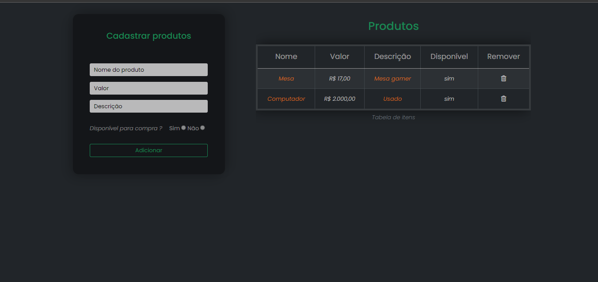
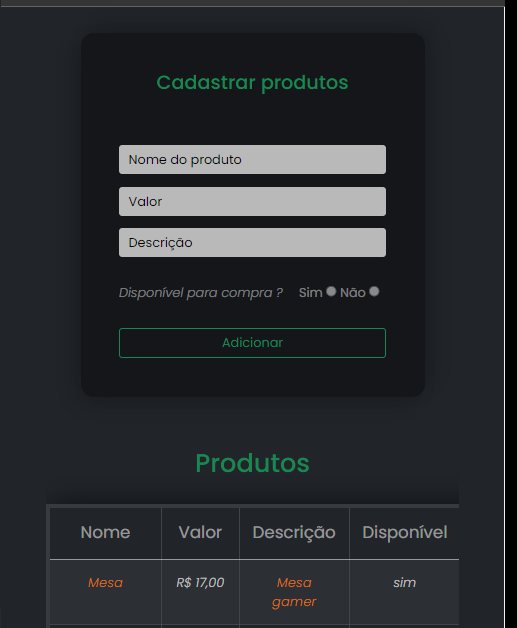

<h1 align = "center">
  Tabela de produtos
</h1>

## O que é ?

 A aplicação é uma tabela no qual pode adicionar, cadastrar e remover itens. Os itens da tabela é por ordem crescente baseado no preço e
 também checa se os campos de entrada estão corretos / preenchidos

## :link: Visualizar projeto
A visualização da aplicação pelo navegador <a href="https://leandroncosta.github.io/product-table/" target="_blank">Clique aqui</a> 

## :rocket: Tecnologias
- HTML
- CSS
- JavaScript

## Demonstração

